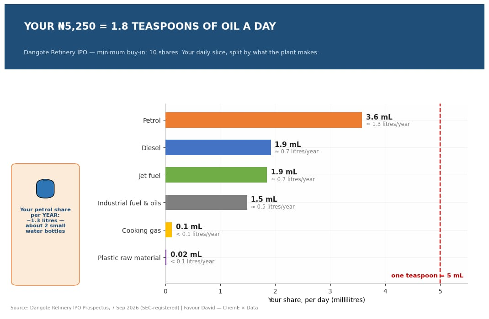
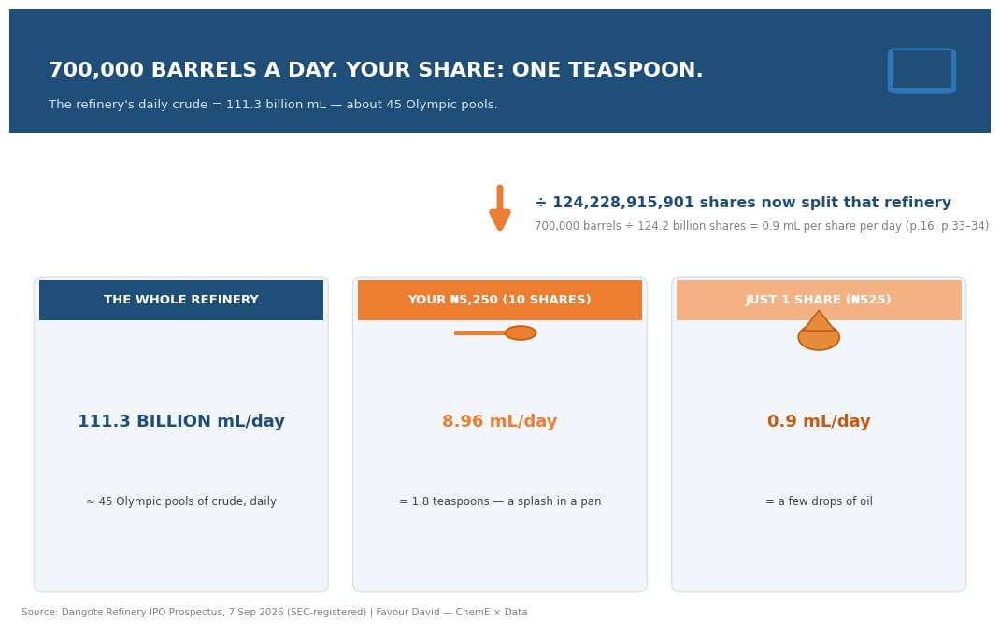
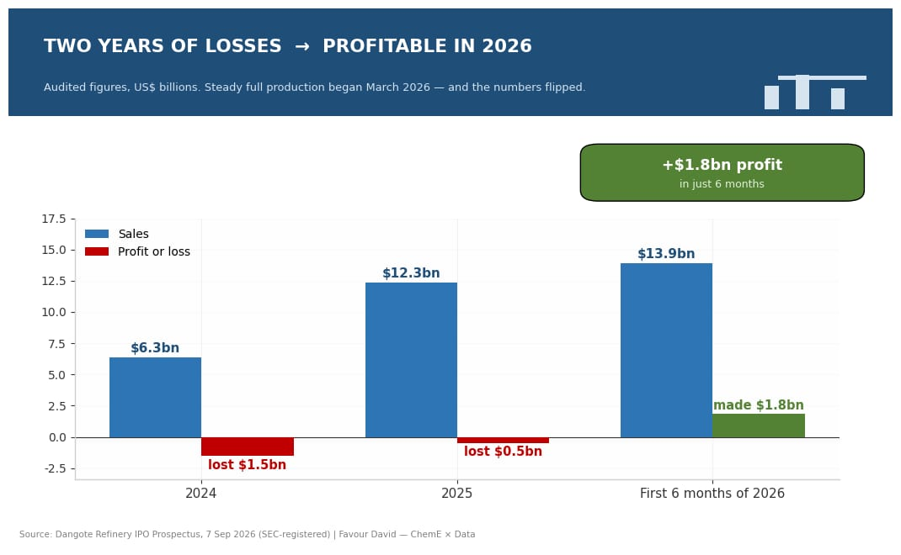
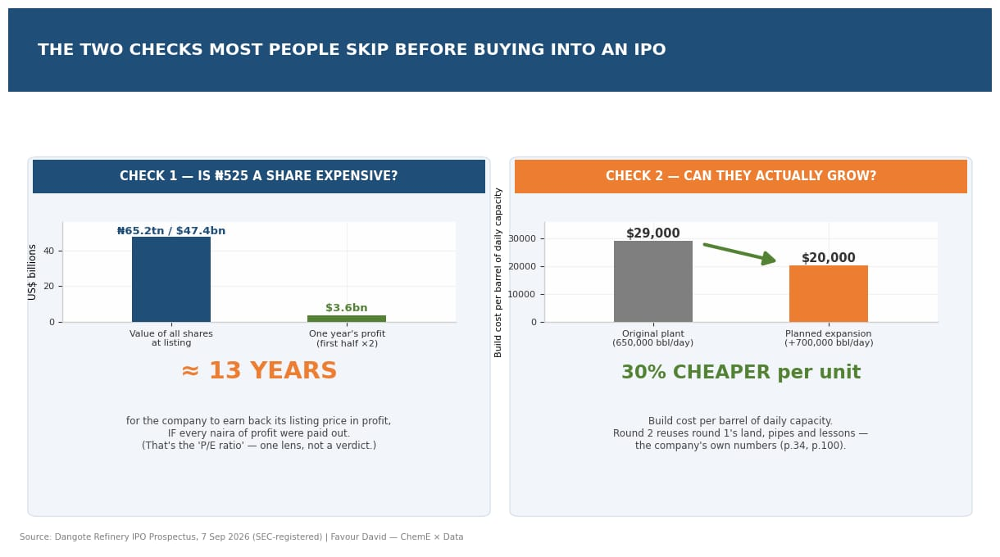

# I Bought a Refinery for ₦5,250

### What the Dangote Refinery IPO actually sells you — measured in teaspoons, bottles of water, and dollars

**Author:** Favour (Chukwuemeka) David — Chemical Engineering student & data analyst

**Data source:** The official Dangote Refinery IPO Prospectus (7 September 2026, registered with Nigeria's SEC). Every number below comes from it — page references included.
**Tools:** Google Sheets only. No code.

---

## First, the plain-English translations

You'll see these words everywhere in IPO coverage. Here's what they actually mean:

| Word people use | What it means |
|---|---|
| **IPO** | The first time a company sells its shares to the public |
| **Share** | A tiny slice of ownership in a company |
| **Barrel (bbl)** | The standard oil container = 159 litres |
| **Barrels per day (bpd)** | How much crude oil a refinery processes every day |
| **Prospectus** | The official document a company must publish before an IPO — audited numbers, by law |
| **Greenshoe** | If demand is huge, the company can sell up to 30% more shares than planned |
| **P/E ratio** | Years of profit it would take to repay the price you're paying |
| **Refining margin** | The profit made from turning one barrel of crude into fuel |

---

## The question

The minimum buy-in for the Dangote Refinery IPO is **10 shares at ₦525 each — ₦5,250**.
Nigerians are joking about becoming "co-owners" of the refinery. I'm a chemical engineering student, so I asked a literal question:

> **If I pay ₦5,250, how much of an actual oil refinery do I own — in physical units?**

Everyone is debating whether the IPO is a good buy. Nobody I could find translated the share price into refinery units. This project does that, using only the official prospectus.

---

## The answer in one picture



**Your ₦5,250 buys you 9 millilitres of crude oil per day — about 1.8 teaspoons.**

## How the math works (2 steps)

**Step 1 — How many slices is the company cut into?**

| Item | Shares | Source |
|---|---|---|
| Shares already in existence | 120,128,915,901 | Prospectus p.33 & p.62 |
| New shares this IPO is selling | 4,100,000,000 | Prospectus p.34 |
| **Total slices after the IPO** | **124,228,915,901** | Calculated |

**Step 2 — Divide the refinery by the slices.**

The refinery processes **700,000 barrels of crude every day** (p.16, p.108 — upgraded from its original 650,000 design after passing performance tests in June 2026).

```
One share's daily crude = 700,000 barrels ÷ 124,228,915,901 shares
                       = 0.0000056 barrels
                       = 0.90 mL  (a few drops)

Your 10 shares (₦5,250) = 9 mL/day  ≈ 1.8 teaspoons
```



## Your 9 mL, split into what the refinery actually makes

These are the refinery's **own product numbers** for the last 12 months (p.111) — not estimates:

| Product | Your share per day | Your share per year |
|---|---|---|
| Petrol | 3.6 mL | **1.3 litres** |
| Diesel | 1.9 mL | 0.7 litres |
| Jet fuel | 1.9 mL | 0.7 litres |
| Industrial fuel & oils | 1.5 mL | 0.5 litres |
| Cooking gas | 0.1 mL | 0.04 litres |
| Plastic raw material | 0.02 mL | 0.01 litres |

**In a year, your petrol share would barely fill two small bottled-water bottles.** That's the physical reality of ₦5,250 of co-ownership — and it's not an insult, it's just what buying 0.000008% of the world's largest single-train refinery looks like.

## The money version

From the audited accounts (p.76):

| | 2024 | 2025 | First 6 months of 2026 |
|---|---|---|---|
| Sales | $6.3bn | $12.3bn | $13.9bn |
| Profit / (loss) | **–$1.5bn** | **–$0.5bn** | **+$1.8bn** |



If the second half of 2026 simply matches the first (an assumption — see Limitations), then:

| | Per year |
|---|---|
| Your ₦5,250's share of sales | ~$2.26 |
| Your ₦5,250's share of profit | **~$0.30 (≈ ₦400)** |

And when the company pays dividends, it pays them **in US dollars** (prospectus dividend policy, pp.129–133) — so a naira-earning investor's dividend holds its value even if the naira slides.

## The two checks most people are skipping



**Check 1 — Is ₦525 a share expensive?**
Total value of all shares at listing: ₦65.2tn (p.35) ≈ $47.4bn. One year's profit (doubling the first half): ~$3.6bn. Divide: **~13 years of profit to repay the price.** That's the P/E ratio. It's neither crazy-cheap nor crazy-expensive — whether it works out depends on the next check.

**Check 2 — Can they actually grow?**
The planned expansion (+700,000 barrels/day by 2029, costing ~$14.3bn, p.34) works out to **$20,000 per barrel of daily capacity — versus $29,000 for the original plant** (p.100). Building round two next to round one is cheaper because the lessons, land, and infrastructure already exist. The company has done the hard part once.

## Why this refinery is a big deal (the engineer's view, in one paragraph)

Most refineries in developing countries score 8.9 on the "complexity" scale that measures how completely a plant squeezes valuable fuel out of each barrel. This one scores **11.5** (p.80) — it's built to squeeze more petrol and diesel out of the same crude. The company estimates a profit of **~$24 per barrel processed in 2026** (p.80). And it supplies essentially all of Nigeria's locally-produced petrol — about **88% of all petrol sold in the country**, imports included (p.80–81).

## Honest limitations (read these before sharing)

1. **The 9 mL assumes the refinery runs at full 700,000 bpd, every day.** Real plants pause for maintenance.
2. **The greenshoe** (up to 30% more shares if demand explodes, p.37) would shrink everyone's slice by ~1%. Base numbers used here.
3. **Doubling the first half of 2026 is arithmetic, not prophecy.** Refining profits swing with oil prices.
4. The product split is the refinery's actual 12-month record, but it shifts a little with the mix of crude used.
5. **A verification catch:** media reported first-half sales of $14.4bn; the audited prospectus says **$13.91bn**. This project uses the audited figure.
6. A second catch, for full transparency: the prospectus's own pages 70 and 76 show slightly different naira figures (~0.1% apart). The dollar figures agree everywhere, so dollars are used throughout.
7. The ~$24/barrel profit figure is the company's own estimate, not a guaranteed result.
8. ₦65.2tn is the listing-day valuation, not a market-tested price.
9. **This is an educational analysis of public documents. It is not investment advice.**

## Recreate it yourself

📊 **[Download the calculator](dangote_refinery_share_calculator.xlsx)** — upload to Google Drive → open with Google Sheets. Four tabs: the verified source numbers (each with its prospectus page), the ownership calculator, the money layer, and the limitations. Change any input and every result updates.

Or with any calculator:
1. 120,128,915,901 + 4,100,000,000 = shares after the IPO
2. 700,000 ÷ that number = barrels per share per day
3. × 159 litres = litres per share per day
4. × the product split from p.111 = your petrol, diesel, jet fuel…

## What's next

- The **expansion to 1.4 million barrels/day by 2029** — where the next chapter of this story lives.
- My next project: the **Cement Price Tracker** — ~8 years of Nigerian cement prices, explained through the process-industry lens (energy, clinker chemistry, logistics).

---

---

## Connect with me

- 💼 LinkedIn: [linkedin.com/in/favour-david-767b072b3](https://www.linkedin.com/in/favour-david-767b072b3)
- ✍️ Substack: [davidfavour2.substack.com](https://davidfavour2.substack.com)
- 🐙 GitHub: [github.com/favourdavidemeka](https://github.com/favourdavidemeka)

---

*Built in public by a final-year Chemical Engineering student learning data analytics. If this changed how you see the IPO, share it — and follow the next build.*
